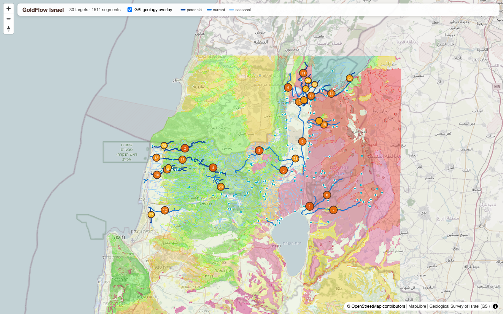
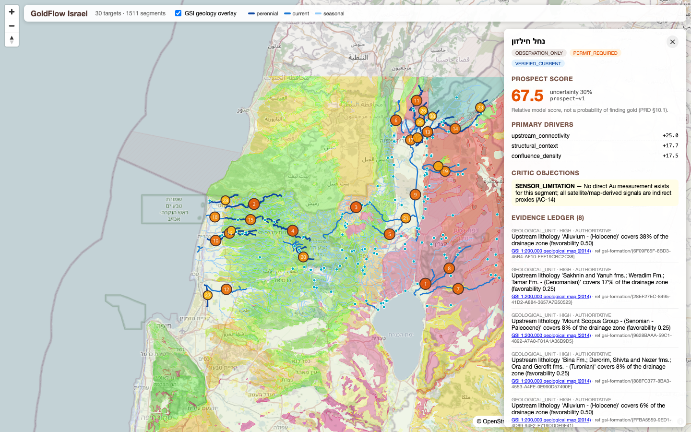

# Evidence-Gated Assessment of Fluvial Placer Gold Prospectivity in Perennial Streams of Northern Israel

**GoldFlow** — an agentic geospatial research system for ranking flowing stream
segments by relative placer-gold potential, with a fully auditable evidence
ledger, deterministic scoring, and a human-gated learning loop.

<p align="center">
  
</p>

---

## Abstract

Placer (alluvial) gold accumulates where three geological conditions coincide:
a mineralized or reworked **source system** upstream, sufficient **transport
energy** to move heavy minerals, and **trap sites** where flow deceleration
allows deposition. This work implements a reproducible, evidence-first
prospectivity assessment over the perennial and currently-flowing stream
network of northern Israel (pilot basin 35.05–35.90°E, 32.85–33.35°N,
EPSG:2039). Every ranked target is derived exclusively from authoritative open
data — the Geological Survey of Israel 1:200,000 geological map, Israel Water
Authority spring-discharge and hydrometric records, Copernicus Sentinel-2 L2A
metadata, and OpenStreetMap waterway geometry — bound into a typed,
append-only evidence ledger with per-claim provenance. A deterministic,
versioned scoring model produces a relative 0–100 potential score with an
explicit uncertainty estimate; a separate guardrail policy layer gates every
target behind Israeli Mining Ordinance permit requirements. Field assay
results feed a closed validation loop that recalibrates model weights under
explicit human review. The system makes **no claim of remote gold detection**;
it ranks where field verification effort is best spent.

## 1. Motivation

Prospectivity mapping is typically performed as a one-off GIS exercise:
manually assembled layers, opaque weighted overlays, results that decay as the
hydrology changes. This project treats prospectivity as a **continuous
research process** instead:

1. Flowing water is a hard precondition, not a layer — placer concentration is
   an active hydraulic process, and dry channels are not actionable. The
   **FlowGate** admits a segment only on verified current flow from official
   measurements, and that verification expires (90–180 days) unless renewed.
2. Every scoring feature must be **grounded in committed evidence**; the
   scorer rejects ungrounded features by construction.
3. Model improvement is **label-driven and human-gated**: field assays create
   validation labels, labels drive calibration, and no fitted model touches
   the live scoring path without explicit activation.

## 2. Study Area

Northern Israel pilot basin: the Galilee and Golan drainage systems, including
the Jordan headwaters (Dan, Hermon/Banias, Snir/Hatzbani), the western Galilee
coastal streams (Kziv, Bezet, Ga'aton), and the Golan plateau streams
(Meshushim, Yehudiya, Daliyot, Sa'ar). This region concentrates Israel's
perennial stream flow and exposes basaltic (Golan/Dalton), carbonate
(Judea/Mount Scopus groups), and alluvial lithologies in close association
with mapped fault systems.

Ingested state (2026-08-15): **2,100** stream segments, **204** springs,
**657** geological units, **415** mapped faults; **113** segments with
verified current flow; **30** ranked targets published.

## 3. Data

| Source | Content | Authority class | Access |
|---|---|---|---|
| Geological Survey of Israel — ArcGIS (`egozi.gsi.gov.il`) | 1:200,000 geological map (2014): formations (Hebrew + English nomenclature), faults, plutonics; vector-tile basemap overlay | Authoritative | ArcGIS REST / GeoJSON |
| Israel Water Authority (data.gov.il CKAN) | Springs catalog, measured spring discharge series, hydrometric station registry | Authoritative | CKAN Datastore API |
| Copernicus Data Space | Sentinel-2 L2A acquisition and cloud-cover metadata | Authoritative EO | STAC API |
| OpenStreetMap (Overpass) | Waterway line geometry carrier | Secondary | Overpass QL, ODbL |

Flow status is **never hardcoded**: a segment is classified
`VERIFIED_PERENNIAL` / `VERIFIED_CURRENT` solely from official
spring-discharge history or active hydrometric stations snapped within 500 m
of the channel. Classification is re-derived daily from live sources.

## 4. Methodology

### 4.1 Evidence ledger

All knowledge enters as typed `Evidence` records (geological unit, structural
feature, flow observation, assay result, remote sensing) with source
reference, authority class, confidence, quality grade, spatial binding, and a
content fingerprint enforcing the deduplication invariant (identical evidence
must never double a score). The ledger is append-only; superseded wording is
retained for audit. Ground-truth assays bind at 200 m to their own segment;
regional evidence joins at 3 km — a deliberate asymmetry that prevents one
segment's assay from validating its neighbors.

### 4.2 Agent pipeline

Each research pass runs per segment: a **geology agent** (upstream catchment
lithology favorability, area-weighted; fault proximity with exponential
decay), a **hydrology agent** (reifies the official flow classification as
evidence), and a **mandatory critic** that raises typed objections — e.g. the
standing sensor-limitation objection that no satellite measures gold directly.
Agents are deterministic policies over the evidence store; their claims,
objections, and rationales are the dossier the user reads (product language:
Hebrew).

### 4.3 Deterministic scoring

Score `S ∈ [0,100]` is a versioned weighted composition over three feature
families — **source system (0.40)**, **transport (0.25)**, **trap (0.35)** —
scaled by an evidence-quality factor and a contamination discount. The scorer
is a pure function: same evidence, same version ⇒ same score (verified by
property-based tests including order and duplicate invariance). Every score
snapshot records the model version that produced it; historical snapshots are
never recomputed.

Uncertainty `U = 1 − (0.45·coverage + 0.25·evidence_mass + 0.30·direct)`,
where `direct = min(1, n_assays/3)`, with an epistemic floor of 0.05 and a
minimum of 0.30 in the absence of direct geochemistry.

### 4.4 Guardrails

A policy layer separate from scoring assigns actionability. Mineral
prospecting in Israel requires a permit under the Mining Ordinance, so every
target carries `PERMIT_REQUIRED` review status regardless of score; safety
(flash-flood exposure) and environmental constraints attach as typed
objections with Hebrew remediation guidance. Scoring can never override a
guardrail.

### 4.5 Validation loop and calibration

Field assays (Au ppb, fire assay or field lab) enter through the API, bind as
assay evidence, and drive state transitions: ≥ 50 ppb ⇒
`VALIDATED_POSITIVE`; ≥ 2 independent clean assays ⇒ `VALIDATED_NEGATIVE`.
Validated targets become labeled examples (family subscore vector, outcome).
The calibration engine — pure, deterministic logistic regression
(fixed-iteration gradient descent, L2-regularized, every-5th-example holdout)
— fits candidate weights once ≥ 20 labels with ≥ 5 per class exist; below
threshold it emits an honest diagnostic report (per-family point-biserial
correlations, enrichment of validated positives over the baseline score
distribution). Candidates are written to a model registry as `CANDIDATE` and
**activate only by explicit human decision** (`POST
/v1/models/{version}/activate`), which retires the prior `ACTIVE` version.

### 4.6 Continuous operation

Three Temporal schedules keep the assessment current: source re-ingestion
every 24 h (flow evidence expires by design — without refresh the FlowGate
degrades targets to `BLOCKED_NO_FLOW`), a full research pass every 12 h, and
daily calibration. All orchestration is a deterministic Temporal workflow;
replay verification shows zero divergence.

## 5. System Architecture

Functional Core / Imperative Shell. The domain layer
(`src/goldflow/domain`) is pure, typed, and Result-monadic — scoring,
uncertainty, guardrails, learning, and state transitions have no I/O. Adapters
(`src/goldflow/infrastructure`) isolate ArcGIS, CKAN, STAC, Overpass, and
PostGIS behind interfaces. Application services compose the two; Temporal
workflows sequence them durably.

**Stack:** Python 3.13 · FastAPI · SQLAlchemy 2 + GeoAlchemy2 (EPSG:2039
canonical) · PostgreSQL/PostGIS · Alembic (forward-only) · Temporal · React +
TypeScript + MapLibre GL (RTL Hebrew UI) · uv · Ruff + Pyright strict ·
pytest + Hypothesis.

<p align="center">
  
</p>

## 6. Results (pilot)

The pilot run ranks 30 flowing-verified targets. Flow classification emerged
entirely from measured data (Bezet, Kziv, Hermon, and Hatzbani basins
classified perennial from official discharge series — none hardcoded).
Acceptance criteria AC-01–AC-14 verified, including: assay ingestion re-ranks
its target (74.64 → 77.31 after an 85 ppb result), duplicate evidence does
not move scores, workflow replay is deterministic, and a neighboring segment
is **not** validated by another segment's assay (200 m binding). With a single
validated label, calibration correctly reports insufficient data
(`fit_performed: false`) while noting the validated positive scores 1.27×
the baseline mean — the expected direction.

## 7. Reproducibility

```bash
docker compose up -d                      # PostGIS + Temporal (+ UI :8233)
uv sync && uv pip install -e .
uv run alembic upgrade head
uv run python scripts/ingest_pilot.py     # live sources → evidence base
uv run python scripts/stac_enrich.py      # Sentinel-2 metadata evidence
uv run python apps/worker/main.py &       # Temporal worker
uv run python scripts/run_research.py     # one research pass
uv run python scripts/setup_schedules.py  # continuous operation
uv run uvicorn apps.api.main:app --port 8100
cd apps/web && pnpm install && pnpm dev   # map UI :5173
```

Quality gates: `uv run ruff check .` · `uv run pyright` · `uv run pytest`
(unit, property-based, contract, workflow-replay suites).

## 8. Limitations

- The score is **relative**, not a probability of gold occurrence
  (documented in-product). No remote-sensing input measures gold.
- Lithology favorability is a keyword-band heuristic over GSI nomenclature
  pending geochemical baseline data.
- The calibration loop is label-starved by design until field campaigns
  accumulate ≥ 20 validated outcomes.
- Pilot scope is a single basin; transport modeling uses network topology and
  slope proxies, not hydraulic simulation.

## 9. Legal and Ethical Notice

This is a research instrument. Mineral prospecting and extraction in Israel
are regulated under the Mining Ordinance; **every** target produced by this
system is marked as requiring permit review, and the system provides
observation-only guidance until legal clearance exists. Respect land access,
nature-reserve boundaries, and flash-flood safety warnings.

## 10. Data Attribution

Geological data © Geological Survey of Israel. Hydrological data © Israel
Water Authority via data.gov.il (open government data). Sentinel-2 metadata ©
European Union Copernicus programme. Waterway geometry © OpenStreetMap
contributors, ODbL.
